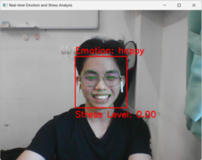

# Facial Stress Index Analyzer System (FSIA)

## PROJECT INTRODUCTION

In today's fast-paced world, stress has become an unavoidable part of daily life, affecting both mental and physical well-being. The Facial Stress Index Analyzer (FSIA) is designed to provide users with valuable insights into their stress patterns over time through routine use. By leveraging advancements in computer vision and machine learning, FSIA offers a non-invasive, convenient, and automated system for daily stress assessment through facial image analysis.

### Main Functionality:

1. **Facial Image Capture**: The system captures facial images using a standard camera.
2. **Real-time Analysis**: It analyzes the captured images in real-time to detect stress levels.
3. **Stress Level Pattern Analysis Over 30 Days**: It provides an overview of stress patterns over a 30-day period, helping users understand their stress trends and triggers.

 

---

## Project Title
Daily Stress Assessment Through Facial Image Analysis

## Student Information
- **Student Name:** TAN GUAN XUN
- **Matric Number:** 287471
- **Supervisor:** Dr. Mohamad Sabri bin Sinal @ Zainal

## 1. Problem and Solution Overview
The Facial Stress Index Analyzer System (FSIA) is designed to revolutionize stress monitoring through facial expression and landmark analysis. Utilizing Python, FSIA provides continuous, accurate stress assessment in both controlled and real-life situations. The system prioritizes dataset diversity and focuses on facial image analysis for reliable stress detection.

**Objective:** To advance stress detection techniques using non-intrusive facial image analysis, achieving high accuracy and reducing bias through diverse datasets and nuanced classification. The system aims to be accessible and user-friendly, with plans for mobile or web-based applications.

## 2. Programming Tools
- **Programming Language:** Python
- **Libraries and Frameworks:**
  - **Image Processing:** OpenCV, dlib
  - **Machine Learning:** DeepFace, CNN, TensorFlow
  - **GUI Development:** tkinter, ttkbootstrap
  - **Other Tools:** PIL, numpy, requests, dataset FER2013
- **IDE:** PyCharm

By following this README, users and developers can understand the functionality and tools used in the Facial Stress Index Analyzer System (FSIA). The detailed descriptions provide a clear picture of the system's capabilities, limitations, and interfaces, ensuring a comprehensive overview of the project's current state.

## Features

- **Facial Image Capture**: Capture high-quality facial images using a standard webcam.
- **Real-time Analysis**: Immediate analysis and stress level detection from captured images.
- **Stress Level Pattern Analysis**: Visualize stress patterns and trends over a 30-day period.
- **Privacy-Preserving**: On-device processing ensures user privacy by not storing raw facial images.

## System Architecture

The FSIA system architecture consists of the following components:

1. **Image Capture Module**: Handles capturing facial images from the user's webcam.
2. **Image Processing Module**: Preprocesses captured images for analysis.
3. **Stress Detection Module**: Uses machine learning models to analyze facial features and detect stress levels.
4. **Data Storage Module**: Stores analyzed data for pattern analysis.
5. **Visualization Module**: Provides visual representation of stress patterns over time.

